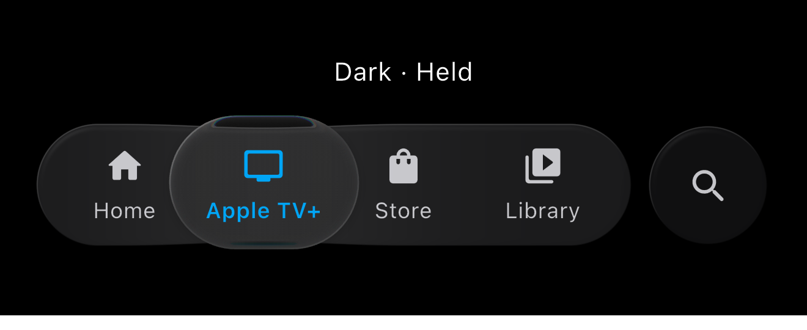
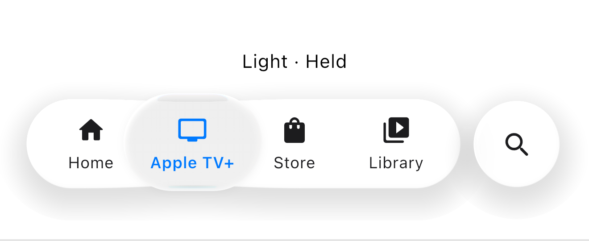
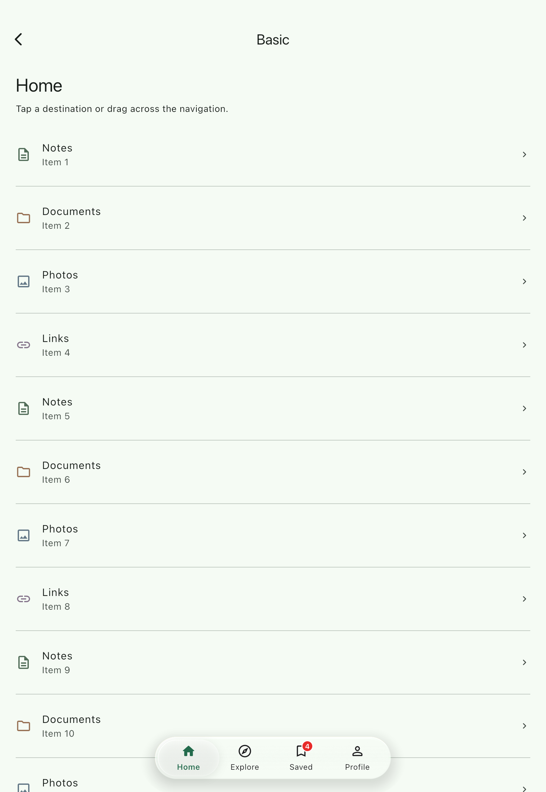
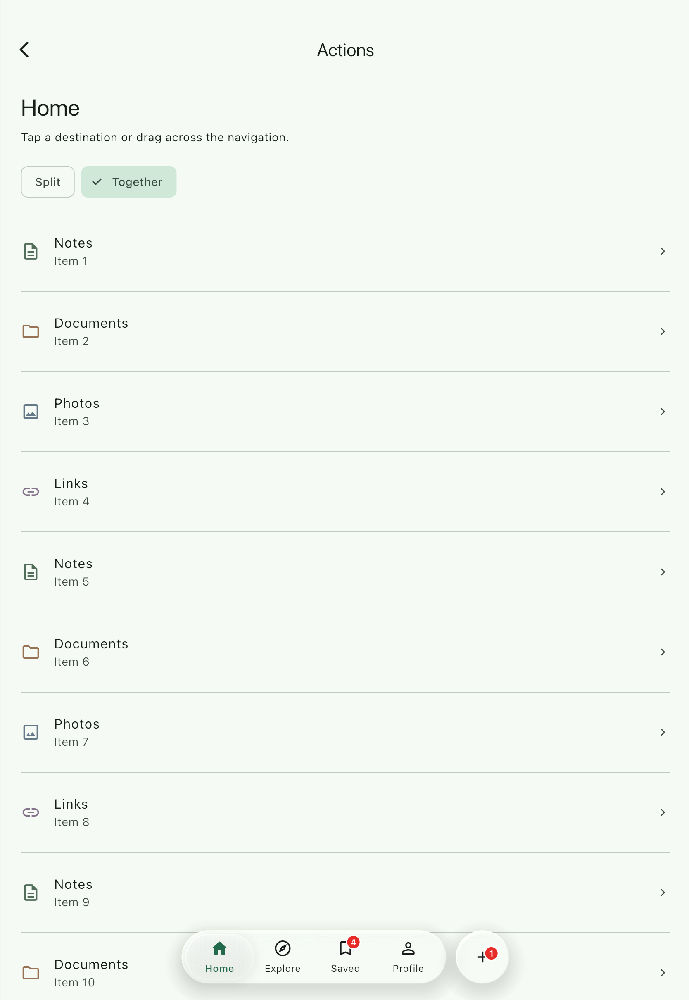
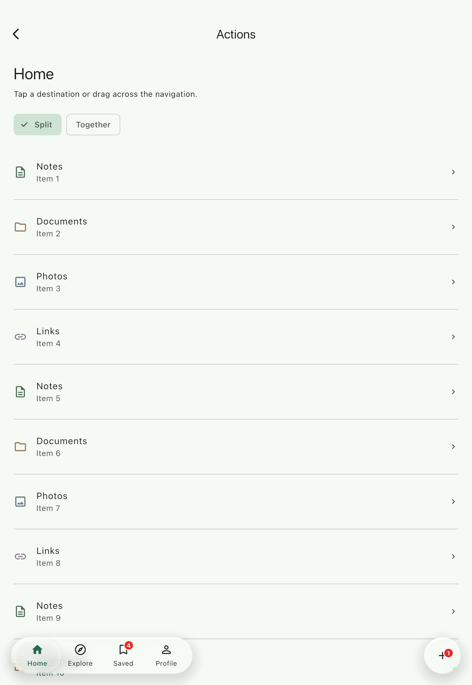
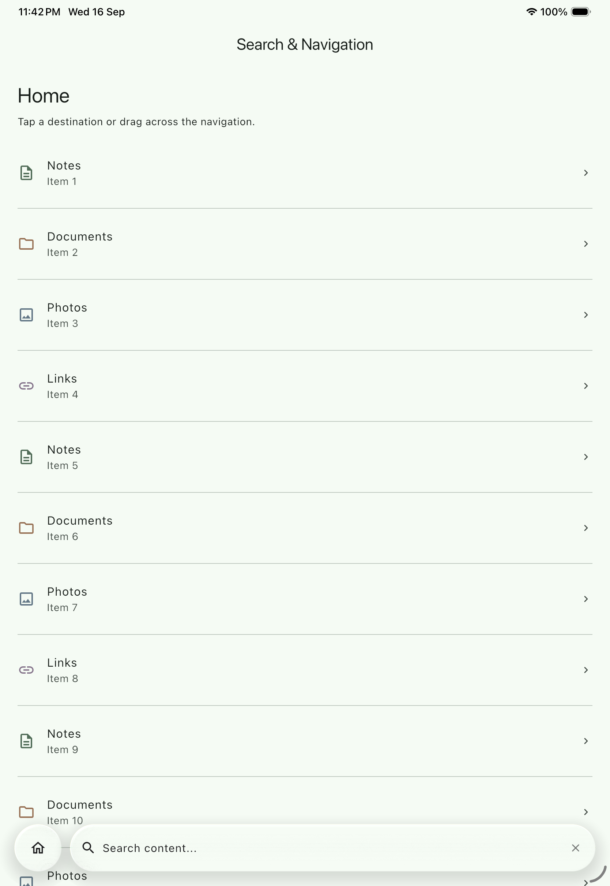
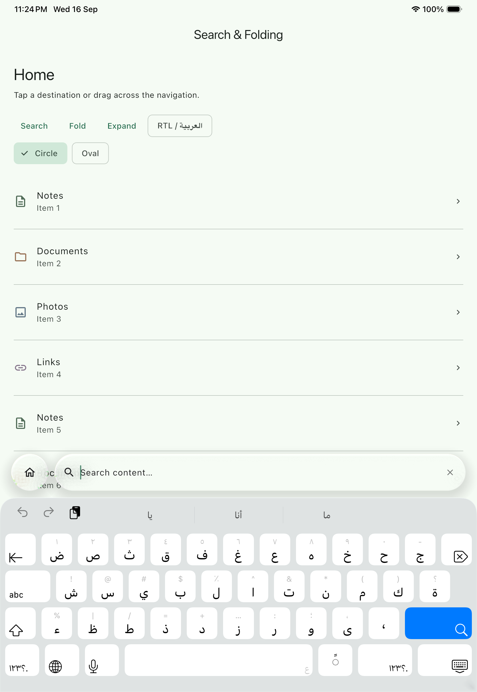
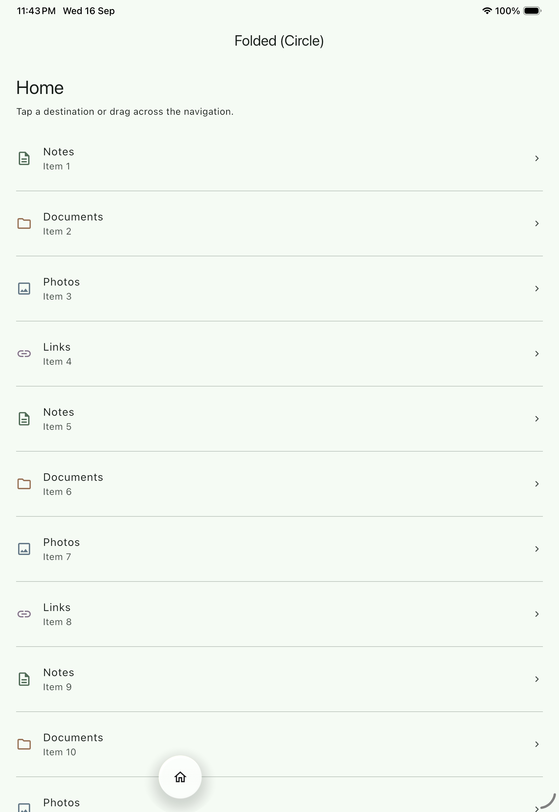
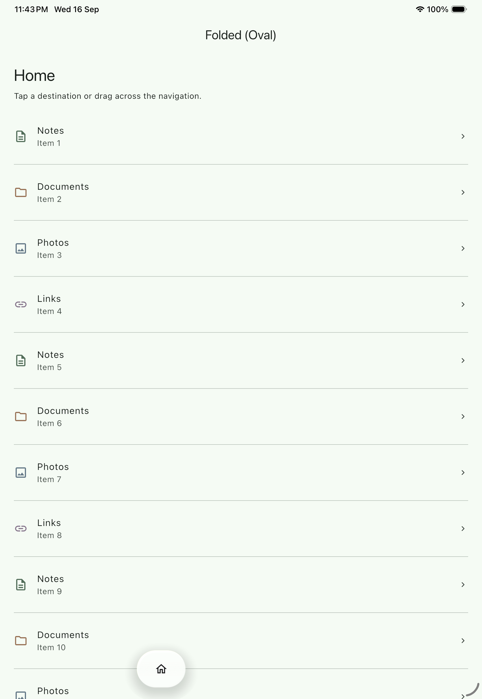

# liquid_tab_bar

A floating liquid-glass navigation bar for Flutter with optical refraction, spring-driven selection, expandable search, actions, badges, and scroll-aware folding.

Current release: `2.0.0`

[](https://pub.dev/packages/liquid_tab_bar)
[](LICENSE)

---

## Visual Showcase

<table>
  <tr>
    <th width="50%">Press & Hold — Dark</th>
    <th width="50%">Press & Hold — Light</th>
  </tr>
  <tr>
    <td></td>
    <td></td>
  </tr>
  <tr>
    <th colspan="2">Basic Navigation</th>
  </tr>
  <tr>
    <td colspan="2"></td>
  </tr>
</table>

---

## Features

- **Fluid Droplet Navigation**: Selection lens driven by analytical spring physics with velocity stretch during interactive scrubbing. Pressing or moving the droplet widens its glass capsule and gives the surrounding bar a subtle lift. Its reflective rim stays visible between tabs and settles back after selection.
- **Physical Optical Refraction**: Snell's-law shader dynamically bends underlying graphics along the moving droplet's bevel rim, returning to zero displacement at rest.
- **Three Material Tiers**: Automatic tier selection across GPU Shader Glass (Impeller), real-time Backdrop Blur, and high-contrast Opaque materials.
- **Expandable Search**: Morphs navigation into an edge-to-edge floating search bar that anchors above the software keyboard without layout jumps.
- **Separate Action Buttons**: Attach standalone actions with grouped (`together`) or edge-spaced (`split`) placement.
- **Custom Widget Icons**: Render arbitrary Flutter widgets (SVGs, raster images, custom painters, and animated widgets) as tab items and search glyphs while preserving theme tinting, droplet movement, badges, and optical refraction.
- **Versatile Badges**: Unread dots, auto-truncating count pills (`99+`), text badges (`PRO`), and custom badge widgets that participate in droplet refraction.
- **Adaptive Scroll Folding**: Automatically collapses into a compact pill on downward scroll and restores on scroll-up or tap.
- **Bidirectional RTL**: Native mirroring for Arabic, Hebrew, and Persian layouts following ambient `Directionality`.
- **Accessibility & Reduced Motion**: VoiceOver/TalkBack semantics and instant value snapping under `MediaQuery.disableAnimationsOf`.
- **Automatic Frame Governor**: Monitors GPU raster times to gracefully step down to blur if dropped frames are detected.

---

## Style Architecture

Version `2.0.0` organizes styling into single-responsibility configuration objects:

| Style Class | Target Layer | Key Properties |
|:---|:---|:---|
| **`LiquidBarStyle`** | Outer capsule | Glass preset (`glass`), blur tint (`blurTint`), opaque fill (`opaqueFill`), border, and drop shadow (`shadow`). |
| **`LiquidDropletSurfaceStyle`** | Moving droplet surface | Gradient (`gradientTop`, `gradientBottom`), border stroke, outer shadow (`shadow`), and opaque fill. |
| **`DropletRefractionStyle`** | Droplet optical refraction | Rim bevel (`thickness`), refractive index (`refractiveIndex`), depth (`baseHeight`), dispersion, specular, and strength. |
| **`LiquidTabActionStyle`** | Separate action | Selected marker highlight fill (`selectedFill`). |
| **`LiquidBadgeStyle`** | Tab & action badges | Fill color (`color`), text color (`textColor`), text style (`textStyle`), size (`size`), dot size, border, and offset. |

---

## Installation

Add `liquid_tab_bar` to your `pubspec.yaml`:

```yaml
dependencies:
  liquid_tab_bar: ^2.0.0
```

Fragment shaders are bundled with the package; no custom asset declarations are required in your host application.

> [!NOTE]
> `liquid_tab_bar` is dependency-free from external SVG or image packages. If you want to render SVG assets, add your preferred package (such as [`flutter_svg`](https://pub.dev/packages/flutter_svg)) to your host application's dependencies.

For the SVG example below, add `flutter_svg` and declare the SVG directory in
the host application's `pubspec.yaml`:

```yaml
dependencies:
  flutter_svg: ^2.3.0

flutter:
  assets:
    - assets/icons/
```

---

## Setup

For the smoothest glass experience, pre-warm the shaders and arm the automatic frame governor before `runApp`:

```dart
void main() async {
  WidgetsFlutterBinding.ensureInitialized();

  await LiquidGlass.load();
  LiquidTabBarController.shared.armGovernor();

  runApp(const MyApp());
}
```

---

## Quick Start

The fastest way to integrate `LiquidTabBar` is with `LiquidTabBarScaffold`, which automatically configures `extendBody: true` and reserves bottom scroll padding:

```dart
LiquidTabBarScaffold(
  body: yourScrollableContent,
  tabBar: LiquidTabBar(
    selectedIndex: _selectedIndex,
    onSelected: (index) => setState(() => _selectedIndex = index),
    items: const [
      LiquidTabItem.icon(
        icon: Icons.home_rounded,
        label: 'Home',
      ),
      LiquidTabItem.icon(
        icon: Icons.search_rounded,
        label: 'Search',
      ),
      LiquidTabItem.icon(
        icon: Icons.person_rounded,
        label: 'Profile',
      ),
    ],
  ),
)
```

---

## Custom Icons

`LiquidTabBar` supports both standard Material/Cupertino `IconData` and arbitrary custom Flutter `Widget`s (such as SVGs, raster images, custom painters, and animated widgets).

### Standard Icons (`IconData`)

For standard glyphs, use the compile-time `const` constructor `LiquidTabItem.icon`:

```dart
const LiquidTabItem.icon(
  label: 'Home',
  icon: Icons.home_outlined,
  activeIcon: Icons.home_rounded,
)
```

`LiquidTabItem.icon` remains the default, first-class workflow for standard icons.

### Custom Widget Icons

Use `LiquidTabItem.custom` to render custom widgets, such as vector icons via `flutter_svg`, raster artwork via `Image.asset`, or custom painters:

```dart
import 'package:flutter_svg/flutter_svg.dart';
import 'package:liquid_tab_bar/liquid_tab_bar.dart';

LiquidTabItem.custom(
  label: 'Explore',
  icon: SvgPicture.asset(
    'assets/icons/explore.svg',
  ),
)
```

> [!NOTE]
> `liquid_tab_bar` does **not** depend on or bundle `flutter_svg` or any specific image library. The package receives a standard Flutter `Widget`; the host application owns its asset packages and widget construction.

Arbitrary Flutter widgets are fully supported:

```dart
LiquidTabItem.custom(
  label: 'Photos',
  icon: Image.asset('assets/photos.png'),
)
```

### Custom Active Icons

Supply `activeIcon` to specify an alternate widget when the tab becomes selected:

```dart
LiquidTabItem.custom(
  label: 'Profile',
  icon: SvgPicture.asset('assets/icons/profile_outline.svg'),
  activeIcon: SvgPicture.asset('assets/icons/profile_filled.svg'),
)
```

Custom active icons follow the exact same selection threshold (`coverage >= 0.5`) and animated spring transitions as standard `IconData` items.

### Theme Color Tinting (`useThemeColor`)

By default, `useThemeColor: true` is enabled. For custom widgets, this dynamically tints the artwork using the bar's resolved theme colors:

```text
inactiveColor
   ↓ (spring droplet interpolation)
activeColor
```

```dart
LiquidTabItem.custom(
  label: 'Favorite',
  icon: SvgPicture.asset('assets/icons/heart.svg'),
  useThemeColor: true, // Default: tints with activeColor/inactiveColor
)
```

### Preserving Multi-Color Artwork

When `useThemeColor: true`, custom artwork is tinted uniformly via `BlendMode.srcIn`. For multi-color logos, badges, or brand artwork, set `useThemeColor: false` to preserve the original colors in both selected and unselected states:

```dart
LiquidTabItem.custom(
  label: 'Brand',
  icon: SvgPicture.asset('assets/icons/brand_multicolor.svg'),
  useThemeColor: false, // Preserves original multi-color artwork
)
```

> [!TIP]
> - **`useThemeColor: true`**: Recommended for monochrome vector icons that should follow your bar's active and inactive theme colors.
> - **`useThemeColor: false`**: Recommended for multi-color logos, user avatars, or artwork whose distinct color regions must remain intact.
> 
> Even with `useThemeColor: false`, the tab item still fully participates in layout, droplet movement, fold transitions, badges, and optical refraction.

### Custom Icon Sizing

Control glyph layout size with `iconSize:` (defaults to `23.0`):

```dart
LiquidTabItem.custom(
  label: 'Explore',
  icon: SvgPicture.asset('assets/icons/explore.svg'),
  iconSize: 20.0,
)
```

Tab items center the glyph within the bar's standard icon slot (`24.0`), with `FittedBox` containing and scaling artwork cleanly within the logical slot bounds without overflowing tab layout.

### Mixed Tab Bar Example

You can seamlessly combine standard icons, custom SVG tabs, and custom search actions in a single bar:

```dart
LiquidTabBar(
  selectedIndex: selectedIndex,
  onSelected: (index) => setState(() => selectedIndex = index),
  items: [
    const LiquidTabItem.icon(
      label: 'Home',
      icon: Icons.home_outlined,
      activeIcon: Icons.home_rounded,
    ),
    LiquidTabItem.custom(
      label: 'Explore',
      icon: SvgPicture.asset('assets/icons/explore.svg'),
    ),
    LiquidTabItem.custom(
      label: 'Profile',
      icon: SvgPicture.asset('assets/icons/profile_outline.svg'),
      activeIcon: SvgPicture.asset('assets/icons/profile_filled.svg'),
    ),
  ],
  separateAction: LiquidTabAction.search(
    customIcon: SvgPicture.asset('assets/icons/search.svg'),
  ),
)
```

*(This example assumes your host application has imported its chosen SVG renderer, such as `flutter_svg`.)*

---

## Styling & Optics

Customize outer materials, brand accents, and droplet fills using `LiquidTabBarTheme`. When omitted, styling automatically adapts to ambient light/dark brightness:

```dart
LiquidTabBar(
  theme: LiquidTabBarTheme.adaptive(context).copyWith(
    activeColor: const Color(0xFF007AFF),
  ),
  // ...
)
```

The default light and dark themes use a translucent capsule, neutral gray
selection, and a soft reflective rim. Motion-only droplet refraction bends the
icons and labels underneath the moving lens; its RGB dispersion creates fine
color fringes at high contrast edges. The blur fallback keeps the same surface
palette and selection styling, while high-contrast mode uses the opaque tier.

Use `const LiquidTabBarTheme()` to force light styling or
`const LiquidTabBarTheme.dark()` to force dark styling. `adaptive(context)` also
uses your app's primary color for the selected icon and label.

### Material Tiers

`LiquidTabBar` supports three rendering tiers, selectable via `material:`:

| Tier | Description |
|:---|:---|
| **`auto`** *(default)* | Uses `glass` when Impeller is active and performance is smooth; falls back to `blur` on legacy renderers or when the frame governor detects slow frames. |
| **`glass`** | GPU fragment shader with Snell's-law refraction, specular rim caustics, and backdrop sampling (requires Impeller). |
| **`blur`** | Cross-platform frosted glass with dual-pass backdrop filtering and rim highlights. |
| **`opaque`** | High-contrast solid-fill capsule for accessibility or power saving. |

### Presets

#### Glossy capsule

Added optional `LiquidBarStyle.glossy(brightness: ...)` for light and dark modes.

Opt into a brighter neutral bevel, luminous tint, and clearer backdrop colors:

```dart
theme: LiquidTabBarTheme.adaptive(context).copyWith(
  barStyle: LiquidBarStyle.glossy(
    brightness: Theme.of(context).brightness,
  ),
),
```

The preset styles the bar and separate action buttons with matching light/dark
palettes and a blur fallback. Light Glossy has brighter white reflections and
less frost; Dark Glossy keeps its translucent charcoal finish.
Try **Glossy** in the **Styling & Refraction** demo.

#### Refraction presets

```dart
DropletRefractionStyle.none()
DropletRefractionStyle.subtle()
DropletRefractionStyle.medium() // default
DropletRefractionStyle.strong()
```

Medium and Strong bend content more deeply, with thin motion-only color fringes
where the curved lens crosses icons and labels. The effect is sampled from the
backdrop and the resting droplet remains unchanged. Set `dispersion: 0` to keep
the bend without RGB separation.

Example:

```dart
theme: const LiquidTabBarTheme(
  dropletRefraction: DropletRefractionStyle.strong(),
),
```

#### Outer glass presets

```dart
GlassStyle.frosted
GlassStyle.prismaticCaustics
GlassStyle.clearCrystal
GlassStyle.deepRefraction
```

Use an outer glass preset through `LiquidBarStyle`:

```dart
theme: LiquidTabBarTheme(
  barStyle: LiquidBarStyle.light.copyWith(
    glass: GlassStyle.prismaticCaustics,
  ),
),
```

#### Light and dark presets

```dart
LiquidTabBarTheme()
LiquidTabBarTheme.dark()
LiquidTabBarTheme.adaptive(context)

LiquidBarStyle.light
LiquidBarStyle.dark

LiquidDropletSurfaceStyle.light
LiquidDropletSurfaceStyle.dark

LiquidTabActionStyle.light
LiquidTabActionStyle.dark
```

The normal default is:

```dart
LiquidTabBarTheme()
```

For most applications, use the theme that follows the surrounding app theme:

```dart
theme: LiquidTabBarTheme.adaptive(context),
```

#### Material modes

```dart
LiquidTabBarMaterial.auto    // default
LiquidTabBarMaterial.glass
LiquidTabBarMaterial.blur
LiquidTabBarMaterial.opaque
```

#### Folded shapes

```dart
LiquidFoldedShape.circle // default
LiquidFoldedShape.oval
```

### Glass & Droplet Surfaces

Outer bar glass is configured via `GlassStyle`. Curated presets include:
- `GlassStyle.frosted`: Balanced diffusion and gentle rim specular (default).
- `GlassStyle.prismaticCaustics`: Vivid chromatic dispersion (`0.32`) with boosted specular highlights (`0.65`).
- `GlassStyle.clearCrystal`: Zero-blur transparent crystal.
- `GlassStyle.deepRefraction`: Heavy optical slab with deep displacement.

```dart
barStyle: LiquidBarStyle.light.copyWith(
  glass: GlassStyle.prismaticCaustics,
)
```

The visible surface appearance of the moving droplet (gradient, border, shadow, and opaque fill) is configured via `LiquidDropletSurfaceStyle`:

```dart
dropletSurfaceStyle: LiquidDropletSurfaceStyle.light.copyWith(
  borderWidth: 1.0,
)
```

Droplet shadow rendering consumes `color`, `blurRadius`, and `offset`.

### Optical Refraction

The moving droplet features physical optical refraction that dynamically distorts underlying icons and labels during motion. At rest, refraction displacement returns strictly to `0.0` to preserve crisp text and icon legibility.

Curated presets:
- `DropletRefractionStyle.none()`: Disables optical displacement completely.
- `DropletRefractionStyle.subtle()`: Gentle boundary displacement.
- `DropletRefractionStyle.medium()`: Balanced default refraction.
- `DropletRefractionStyle.strong()`: Pronounced curvature and deeper displacement.

```dart
dropletRefraction: const DropletRefractionStyle.medium(),
```

**Advanced optical controls**:

| Parameter | Purpose |
|:---|:---|
| **`thickness`** | Optical rim bevel width in logical pixels. |
| **`refractiveIndex`** | Snell optical index of refraction (1.50 = standard glass). |
| **`baseHeight`** | Optical standoff depth for ray projection. |
| **`dispersion`** | Chromatic dispersion (RGB wavelength split). |
| **`specularStrength`** | Highlight intensity along the moving refractive boundary rim. |
| **`refractionStrength`** | Master displacement multiplier (`0.0` disables, `1.0` standard). |

---

## Actions & Placement

<table>
  <tr>
    <th width="50%">Together Placement (<code>LiquidTabActionPlacement.together</code>)</th>
    <th width="50%">Split Placement (<code>LiquidTabActionPlacement.split</code>)</th>
  </tr>
  <tr>
    <td></td>
    <td></td>
  </tr>
</table>

Attach a standalone circular button (such as Create, Filter, or Search) alongside the navigation capsule:

```dart
separateAction: LiquidTabAction.icon(
  icon: Icons.add_rounded,
  tooltip: 'Create',
  onTap: handleCreate,
),
separateActionPlacement: LiquidTabActionPlacement.together, // or .split
```

- **`LiquidTabActionPlacement.together`** *(default)*: Groups the action circle adjacent to the main capsule.
- **`LiquidTabActionPlacement.split`**: Pins the main capsule to the leading margin and the action button to the trailing margin.
- **Action styling**: Customize the selected action background marker via `actionStyle: const LiquidTabActionStyle(selectedFill: ...)`.

---

## Notification Badges

`LiquidTabItem` includes integrated notification badges with four display modes:

```dart
// 1. Unread dot
LiquidTabItem.icon(
  icon: Icons.mail_rounded,
  label: 'Inbox',
  badge: true,
),

// 2. Count pill (auto-formats 99+ above 99)
LiquidTabItem.icon(
  icon: Icons.notifications_rounded,
  label: 'Alerts',
  badge: true,
  badgeCount: 4,
),
```

- **Text pill**: Pass `badgeText: 'PRO'` for custom string badges.
- **Custom widget**: Supply `badgeWidget` for custom indicator layouts.
- **Styling**: Configure colors, borders, typography, and offsets via `LiquidBadgeStyle`.
- **Optical interaction**: Normal tab badges participate in droplet refraction when overlapped by the moving lens.

---

## Expandable Search

<table>
  <tr>
    <th width="50%">Expanded Search</th>
    <th width="50%">Search with Keyboard Visible</th>
  </tr>
  <tr>
    <td></td>
    <td></td>
  </tr>
</table>

Transform the navigation bar into an edge-to-edge floating search field:

```dart
separateAction: LiquidTabAction.search(
  hintText: 'Search notes, files...',
  clearOnClose: true,
  onChanged: (query) => onFilter(query),
  onSubmitted: (query) => performSearch(query),
  onClose: () => onSearchClosed(),
),
```

- **Keyboard-aware**: Automatically floats above the on-screen software keyboard without artificial layout height jumps.
- **Programmatic & gesture control**: Dismisses on close tap or Android back button, and can be driven programmatically via `controller.openSearch()` and `controller.closeSearch()`.

### Custom Search Icon

Pass `customIcon` to supply a custom widget (e.g. SVG or image) for the Search action:

```dart
separateAction: LiquidTabAction.search(
  hintText: 'Search notes, files...',
  customIcon: SvgPicture.asset('assets/icons/search.svg'),
  clearOnClose: true,
  onChanged: (query) => onFilter(query),
),
```

The custom icon source is shared across both Search presentation states:
- **Closed circular action**: Displays the custom widget with standard tap scale animations and theme color tinting.
- **Expanded Search field**: Displays the exact same custom widget as the leading icon in the search input field rather than reverting to `Icons.search_rounded`.

#### Search Theme Tinting & Original Colors

Like custom tab items, `LiquidTabAction.search` supports `useThemeColor`:

```dart
// Theme-tinted (default): tints with button color when closed, inactiveColor when expanded
LiquidTabAction.search(
  customIcon: SvgPicture.asset('assets/icons/search.svg'),
  useThemeColor: true,
)

// Original colors: preserves multi-color artwork while maintaining smooth open/close fade
LiquidTabAction.search(
  customIcon: SvgPicture.asset('assets/icons/search_multicolor.svg'),
  useThemeColor: false,
)
```

#### Action Geometry (`size`) vs Glyph Dimensions (`iconSize`)

`LiquidTabAction.search` strictly separates outer button geometry from glyph dimensions:

| Property | Purpose | Default |
|:---|:---|:---|
| **`size`** | Outer capsule width & height of the circular Search button. | `64.0` |
| **`iconSize`** | Dimensions of the visual glyph / custom widget container. | `24.0` (closed) / `22.0` (expanded) |

Specifying `iconSize` resizes only the glyph layout without altering the outer button geometry:

```dart
LiquidTabAction.search(
  customIcon: SvgPicture.asset('assets/icons/search.svg'),
  iconSize: 28.0, // 28×28 glyph layout inside the standard 64×64 circular capsule
)
```

---

## Adaptive Folding

<table>
  <tr>
    <th width="50%">Circle Folded Shape (<code>LiquidFoldedShape.circle</code>)</th>
    <th width="50%">Oval Folded Shape (<code>LiquidFoldedShape.oval</code>)</th>
  </tr>
  <tr>
    <td></td>
    <td></td>
  </tr>
</table>

### Automatic Folding (Recommended)

When using `LiquidTabBarScaffold`, vertical scrolling in primary body scrollables automatically folds the bar into a compact pill showing only the active tab:

```dart
LiquidTabBarScaffold(
  body: ListView.builder(
    itemCount: 50,
    itemBuilder: (context, i) => ListTile(title: Text('Item $i')),
  ),
  tabBar: LiquidTabBar(
    shrinkOnScroll: true,                  // Set false to keep permanently expanded
    foldedShape: LiquidFoldedShape.circle, // .circle or .oval
    // ...
  ),
)
```

`LiquidTabBarScaffold` automatically observes primary vertical body scrolling; no `NotificationListener` or controller management is required for normal layouts. Scrolling back up, reaching the top of content, or tapping the folded capsule smoothly unfolds the bar.

### Manual Integration (Advanced Escape Hatch)

For custom `Scaffold` layouts, multiple independent vertical scroll sources, or complex nested scrolling, forward notifications explicitly:

```dart
final controller = LiquidTabBarController();

NotificationListener<ScrollNotification>(
  onNotification: controller.handleScroll,
  child: myScrollView,
)

LiquidTabBar(
  controller: controller,
  shrinkOnScroll: true,
  // ...
)
```

---

## Controller

Use `LiquidTabBarController` to coordinate folding, search, and performance monitoring programmatically:

| Capability | Methods & Properties |
|:---|:---|
| **Folding** | `minimize()`, `expand()`, `minimized` |
| **Search** | `openSearch()`, `closeSearch({clearText})`, `isSearching` |
| **Manual Scroll** | `handleScroll(notification, {allowNested})` |
| **Performance** | `armGovernor()`, `isGovernorArmed`, `isDegraded` |

> [!NOTE]
> Tab selection is owned by your Flutter state via `selectedIndex` and `onSelected`.

---

## Scroll Padding

Because `LiquidTabBar` floats above content, underlying scroll views must reserve bottom padding so the final items are not obscured:

| Layout Architecture | Recommended Strategy |
|:---|:---|
| **`LiquidTabBarScaffold`** | **Automatic (Recommended)** — applies bottom padding and enables `extendBody: true`. |
| **Standard `Scaffold`** | Wrap scrollable in `LiquidScrollPadding(child: ...)`. |
| **Custom Box/List** | Set `padding: LiquidTabBar.reservedPadding(context)`. |
| **`CustomScrollView` Slivers** | Append `const SliverLiquidScrollPadding()` as the trailing sliver. |

If a `Scaffold` has `extendBody: true` but the scroll view lacks reserved padding, `LiquidTabBar` emits an actionable warning in debug mode (silence via `warnOnMissingExtendBodyPadding: false` or `LiquidTabBar.disableExtendBodyWarning = true`).

---

## RTL & Bidirectionality

`LiquidTabBar` automatically follows the app's ambient `Directionality`. RTL layouts (such as Arabic, Hebrew, and Persian) mirror tab ordering, gestures, and action placements with zero package-specific configuration.

---

## Accessibility & Reduced Motion

- **Screen Readers**: Exposes accessible `Semantics` for all tab items, active states, notification counts, search fields, and folded expand triggers.
- **Reduced Motion**: Respects `MediaQuery.disableAnimationsOf(context)` by snapping spring simulations and search transitions to target values without delay or organic stretch.

---

## Advanced Governor Tuning

When armed at startup via `LiquidTabBarController.shared.armGovernor()`, the governor monitors GPU raster timings during glass shader execution and automatically downgrades to backdrop blur if slow frames exceed default thresholds (`rasterThresholdMs: 24`, `maxSlowFrames: 12`).

For custom performance budgets, configure explicit thresholds on your controller:

```dart
final controller = LiquidTabBarController(
  governorConfig: const LiquidGovernorConfig(
    rasterThresholdMs: 20,
    maxSlowFrames: 8,
  ),
);
controller.armGovernor();
```

---

## Migration from 0.2.x to 0.3.0

Version `0.3.0` streamlines configuration into dedicated style objects:
- Use `LiquidBarStyle` for outer navigation bar surfaces.
- Use `LiquidDropletSurfaceStyle` for droplet visual appearance.
- Use `DropletRefractionStyle` for optical refraction physics.
- Use `shrinkOnScroll` instead of the removed `foldOnScroll`.
- `LiquidTabItem.icon` now supports compile-time `const` construction.

For comprehensive migration steps and before/after comparisons, see the [0.3.0 Migration Guide](doc/migration_0.3.0.md).

---

## Example Application

The repository includes five focused interactive demonstrations:

- **Basic Navigation**: Standard bottom bar with fluid spring droplet.
- **Styling & Refraction**: Custom materials, light/dark themes, and refraction presets.
- **Action Buttons**: Together and Split action placements.
- **Search & Folding**: Expandable search morphing, circle/oval folding, and live RTL layout.
- **Custom Icons Demo**: Standard `IconData`, custom SVG widgets, activeIcon switching, theme tinting vs original multi-color artwork, custom Search glyphs, and Search glyph sizing.

```sh
cd example
flutter run
```

---

## License

This package is licensed under the MIT License. See [LICENSE](LICENSE) for details.
