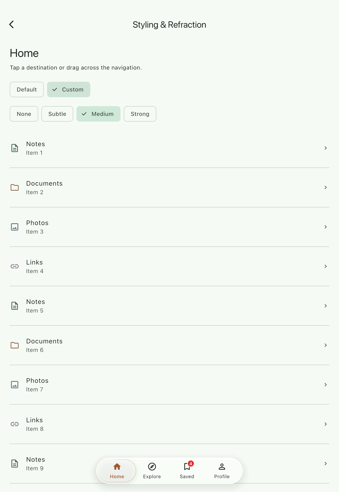
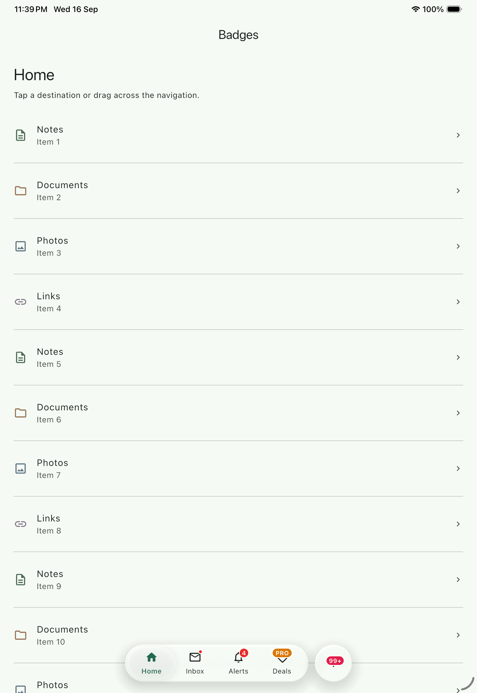
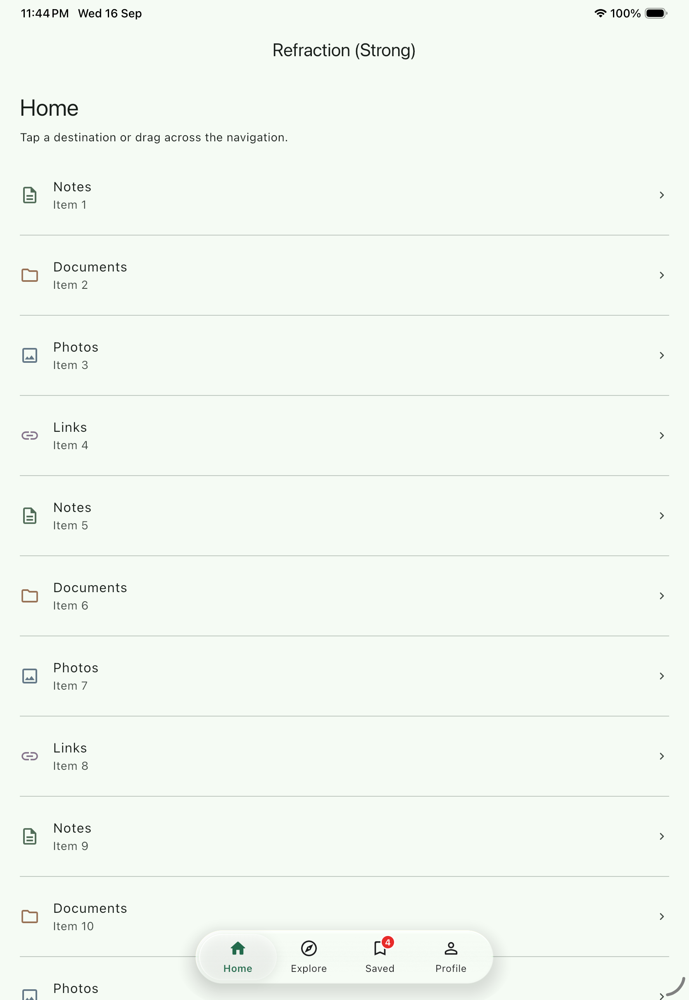
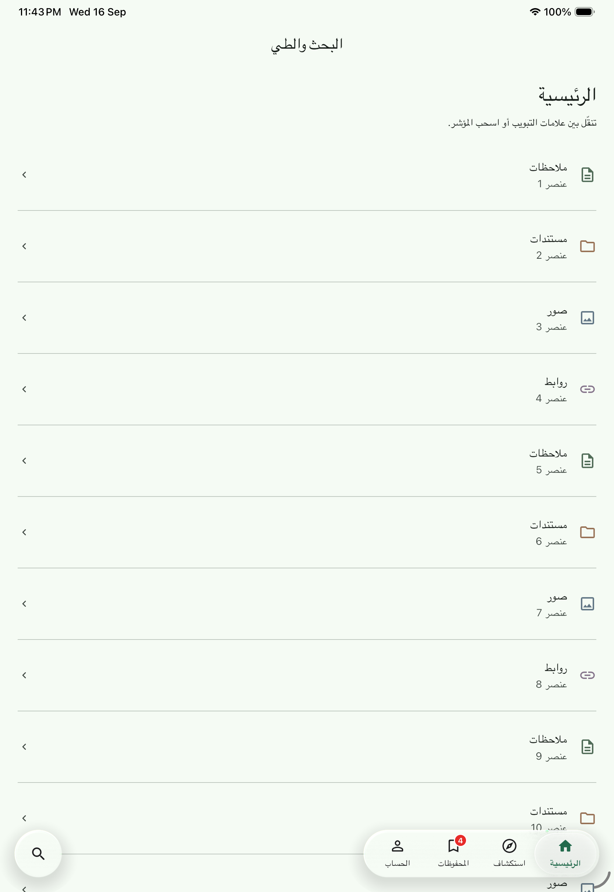

# liquid_tab_bar

Floating liquid-glass navigation bars for Flutter: optical refraction,
spring-driven selection, expandable search, actions, badges, and scroll-aware
folding.

[](https://pub.dev/packages/liquid_tab_bar)
[](LICENSE)

---

## Two bars, one package

They are two answers to the same question, not a bar and its successor. Pick
the one whose selection lens behaves the way you want.

| | **The default bar** | **The droplet** |
|:---|:---|:---|
| Import | `package:liquid_tab_bar/liquid_tab_bar.dart` | `package:liquid_tab_bar/droplet.dart` |
| The lens | A pane of glass in its own right | A contained pill |
| On press | **Grabs** — balloons past the capsule while the glass magnifies the tab it holds | Swells 6% |
| Refraction | The lens bends the page it slides over | A shader bends the icons and labels *behind* it, while it moves |
| Extras | — | Scaffold, expandable search, separate actions, badges |
| Scroll folding | You forward the notifications | `LiquidTabBarScaffold` does it |

Both carry the three material tiers, the spring, finger scrubbing, fold on
scroll, RTL, reduced motion and the frame governor.

Their type names overlap on purpose — both call their widget `LiquidTabBar`
and their theme `LiquidTabBarTheme` — so import one, or prefix the other:

```dart
import 'package:liquid_tab_bar/liquid_tab_bar.dart';
import 'package:liquid_tab_bar/droplet.dart' as droplet;
```

---

## The default bar

```dart
import 'package:liquid_tab_bar/liquid_tab_bar.dart';

Future<void> main() async {
  WidgetsFlutterBinding.ensureInitialized();
  await LiquidGlass.load(); // the shader, once; it falls back to blur without it
  LiquidTabBarController.shared.armGovernor();
  runApp(const MyApp());
}
```

Put it in a `Scaffold(extendBody: true)` so the page passes underneath, and
give the page `LiquidTabBar.reservedHeight(context)` of bottom padding. One
bar over every tab page (an `IndexedStack`) lets the lens slide from the old
tab to the new one.

```dart
Scaffold(
  extendBody: true,
  body: NotificationListener<ScrollNotification>(
    onNotification: LiquidTabBarController.shared.handleScroll,
    child: IndexedStack(index: _tab, children: pages),
  ),
  bottomNavigationBar: LiquidTabBar(
    items: [
      LiquidTabItem.icon(label: 'Home', icon: Icons.home_outlined, activeIcon: Icons.home),
      LiquidTabItem.icon(label: 'Orders', icon: Icons.receipt_long_outlined, badge: true),
      LiquidTabItem.icon(label: 'Wallet', icon: Icons.account_balance_wallet_outlined),
      LiquidTabItem.icon(label: 'Me', icon: Icons.person_outline),
    ],
    selectedIndex: _tab,
    onSelected: (i) => setState(() => _tab = i),
  ),
)
```

**The grab.** A press balloons the lens past the capsule — taller than the
bar, escaping its top and bottom edge evenly — and the glass magnifies the tab
it holds, the colour channels zooming slightly apart so the enlarged glyph
fringes at its own edges. It rides one spring, up on touch-down and home on
release. `LiquidTabBarTheme(pressLens: false)` restores the older, quieter
swell instead.

**Scrub.** Press and drag along the bar and the lens is glued to your finger,
ticking at every tab; release to choose, the lens landing with the speed you
gave it.

`LiquidTabItem` takes an `iconBuilder` for custom glyphs (SVGs, say); the bar
hands it the colour and whether the tab is selected. `LiquidTabBarTheme`
carries every colour and number — including `pressLens`;
`LiquidTabBarController.material` pins a tier (`glass`, `blur`, `opaque`) or
leaves it `auto`.

---

# The droplet variant

Everything below this line documents
`package:liquid_tab_bar/droplet.dart`.

---

## Visual Showcase

<table>
  <tr>
    <th width="50%">Fluid Droplet Navigation</th>
    <th width="50%">Custom Glass & Refraction</th>
  </tr>
  <tr>
    <td></td>
    <td></td>
  </tr>
  <tr>
    <th width="50%">Expandable Search Morph</th>
    <th width="50%">Badges & Optical Sampling</th>
  </tr>
  <tr>
    <td></td>
    <td></td>
  </tr>
</table>

---

## Features

- **Fluid Droplet Navigation**: Selection lens driven by analytical spring physics with velocity stretch during interactive scrubbing.
- **Physical Optical Refraction**: Snell's-law shader dynamically bends underlying graphics along the moving droplet's bevel rim, returning to zero displacement at rest.
- **Three Material Tiers**: GPU shader glass (Impeller), real-time backdrop blur, and a high-contrast opaque fill — picked for the device automatically, or pinned by hand.
- **Expandable Search**: Morphs navigation into an edge-to-edge floating search bar that anchors above the software keyboard without layout jumps.
- **Separate Action Buttons**: Attach standalone actions with grouped (`together`) or edge-spaced (`split`) placement.
- **Versatile Badges**: Unread dots, auto-truncating count pills (`99+`), text badges (`PRO`), and custom badge widgets that participate in droplet refraction.
- **Adaptive Scroll Folding**: Automatically collapses into a compact pill on downward scroll and restores on scroll-up or tap.
- **Bidirectional RTL**: Native mirroring for Arabic, Hebrew, and Persian layouts following ambient `Directionality`.
- **Accessibility & Reduced Motion**: VoiceOver/TalkBack semantics and instant value snapping under `MediaQuery.disableAnimationsOf`.
- **Automatic Frame Governor**: Monitors GPU raster times to gracefully step down to blur if dropped frames are detected.

---

## Style Architecture

The droplet organizes styling into single-responsibility configuration objects:

| Style Class | Target Layer | Key Properties |
|:---|:---|:---|
| **`LiquidBarStyle`** | Outer capsule | Glass preset (`glass`), blur tint (`blurTint`), opaque fill (`opaqueFill`), border, and drop shadow (`shadow`). |
| **`LiquidDropletSurfaceStyle`** | Moving droplet surface | Gradient (`gradientTop`, `gradientBottom`), border stroke, outer shadow (`shadow`), and opaque fill. |
| **`DropletRefractionStyle`** | Droplet optical refraction | Rim bevel (`thickness`), refractive index (`refractiveIndex`), depth (`baseHeight`), dispersion, specular, and strength. |
| **`LiquidTabActionStyle`** | Separate action | Selected marker highlight fill (`selectedFill`). |
| **`LiquidBadgeStyle`** | Tab & action badges | Fill color (`color`), text color (`textColor`), text style (`textStyle`), size (`size`), dot size, border, and offset. |

---

## Installation

Add `liquid_tab_bar` to your `pubspec.yaml`:

```yaml
dependencies:
  liquid_tab_bar: ^1.2.0
```

Fragment shaders are bundled with the package; no custom asset declarations are required in your host application.

---

## Setup

For the smoothest glass experience, pre-warm the shaders and arm the automatic frame governor before `runApp`:

```dart
void main() async {
  WidgetsFlutterBinding.ensureInitialized();

  await LiquidGlass.load();
  LiquidTabBarController.shared.armGovernor();

  runApp(const MyApp());
}
```

---

## Quick Start

The fastest way to integrate `LiquidTabBar` is with `LiquidTabBarScaffold`, which automatically configures `extendBody: true` and reserves bottom scroll padding:

```dart
LiquidTabBarScaffold(
  body: yourScrollableContent,
  tabBar: LiquidTabBar(
    selectedIndex: _selectedIndex,
    onSelected: (index) => setState(() => _selectedIndex = index),
    items: const [
      LiquidTabItem.icon(
        icon: Icons.home_rounded,
        label: 'Home',
      ),
      LiquidTabItem.icon(
        icon: Icons.search_rounded,
        label: 'Search',
      ),
      LiquidTabItem.icon(
        icon: Icons.person_rounded,
        label: 'Profile',
      ),
    ],
  ),
)
```

---

## Styling & Optics

<p align="center">
  
</p>

Customize outer materials, brand accents, and droplet fills using `LiquidTabBarTheme`. When omitted, styling automatically adapts to ambient light/dark brightness:

```dart
LiquidTabBar(
  theme: LiquidTabBarTheme.adaptive(context).copyWith(
    activeColor: const Color(0xFF007AFF),
    barStyle: LiquidBarStyle.light.copyWith(
      glass: GlassStyle.prismaticCaustics,
      blurTint: const Color(0x35FFFFFF),
    ),
    dropletSurface: LiquidDropletSurfaceStyle.light.copyWith(
      borderWidth: 1.0,
    ),
  ),
  // ...
)
```

### Material Tiers

`LiquidTabBar` renders in one of three tiers. `material:` picks one, or `auto` chooses for the device:

| Tier | Description |
|:---|:---|
| **`auto`** *(default)* | Uses `glass` when Impeller is active and performance is smooth; falls back to `blur` on legacy renderers or when the frame governor detects slow frames. |
| **`glass`** | GPU fragment shader with Snell's-law refraction, specular rim caustics, and backdrop sampling (requires Impeller). |
| **`blur`** | Cross-platform frosted glass with dual-pass backdrop filtering and rim highlights. |
| **`opaque`** | High-contrast solid-fill capsule for accessibility or power saving. |

### Glass & Droplet Surfaces

Outer bar glass is configured via `GlassStyle`. Curated presets include:
- `GlassStyle.frosted`: Balanced diffusion and gentle rim specular (default).
- `GlassStyle.prismaticCaustics`: Vivid chromatic dispersion (`0.32`) with boosted specular highlights (`0.65`).
- `GlassStyle.clearCrystal`: Zero-blur transparent crystal.
- `GlassStyle.deepRefraction`: Heavy optical slab with deep displacement.

```dart
barStyle: LiquidBarStyle.light.copyWith(
  glass: GlassStyle.prismaticCaustics,
)
```

The visible surface appearance of the moving droplet (gradient, border, shadow, and opaque fill) is configured via `LiquidDropletSurfaceStyle`:

```dart
dropletSurface: LiquidDropletSurfaceStyle.light.copyWith(
  borderWidth: 1.0,
)
```

Droplet shadow rendering consumes `color`, `blurRadius`, and `offset`.

### Optical Refraction

<table>
  <tr>
    <th width="50%">Subtle Refraction (<code>DropletRefractionStyle.subtle</code>)</th>
    <th width="50%">Strong Refraction (<code>DropletRefractionStyle.strong</code>)</th>
  </tr>
  <tr>
    <td></td>
    <td></td>
  </tr>
</table>

The moving droplet features physical optical refraction that dynamically distorts underlying icons and labels during motion. At rest, refraction displacement returns strictly to `0.0` to preserve crisp text and icon legibility.

Curated presets:
- `DropletRefractionStyle.none()`: Disables optical displacement completely.
- `DropletRefractionStyle.subtle()`: Gentle boundary displacement.
- `DropletRefractionStyle.medium()`: Balanced default refraction.
- `DropletRefractionStyle.strong()`: Pronounced curvature and deeper displacement.

```dart
dropletRefraction: const DropletRefractionStyle.medium(),
```

**Advanced optical controls**:

| Parameter | Purpose |
|:---|:---|
| **`thickness`** | Optical rim bevel width in logical pixels. |
| **`refractiveIndex`** | Snell optical index of refraction (1.50 = standard glass). |
| **`baseHeight`** | Optical standoff depth for ray projection. |
| **`dispersion`** | Chromatic dispersion (RGB wavelength split). |
| **`specularStrength`** | Highlight intensity along the moving refractive boundary rim. |
| **`refractionStrength`** | Master displacement multiplier (`0.0` disables, `1.0` standard). |

---

## Actions & Placement

<table>
  <tr>
    <th width="50%">Together Placement (<code>LiquidTabActionPlacement.together</code>)</th>
    <th width="50%">Split Placement (<code>LiquidTabActionPlacement.split</code>)</th>
  </tr>
  <tr>
    <td></td>
    <td></td>
  </tr>
</table>

Attach a standalone circular button (such as Create, Filter, or Search) alongside the navigation capsule:

```dart
separateAction: LiquidTabAction.icon(
  icon: Icons.add_rounded,
  tooltip: 'Create',
  onTap: handleCreate,
),
separateActionPlacement: LiquidTabActionPlacement.together, // or .split
```

- **`LiquidTabActionPlacement.together`** *(default)*: Groups the action circle adjacent to the main capsule.
- **`LiquidTabActionPlacement.split`**: Pins the main capsule to the leading margin and the action button to the trailing margin.
- **Action styling**: Customize the selected action background marker via `actionStyle: const LiquidTabActionStyle(selectedFill: ...)`.

---

## Notification Badges

<p align="center">
  
</p>

`LiquidTabItem` includes integrated notification badges with four display modes:

```dart
// 1. Unread dot
LiquidTabItem.icon(
  icon: Icons.mail_rounded,
  label: 'Inbox',
  badge: true,
),

// 2. Count pill (auto-formats 99+ above 99)
LiquidTabItem.icon(
  icon: Icons.notifications_rounded,
  label: 'Alerts',
  badge: true,
  badgeCount: 4,
),
```

- **Text pill**: Pass `badgeText: 'PRO'` for custom string badges.
- **Custom widget**: Supply `badgeWidget` for custom indicator layouts.
- **Styling**: Configure colors, borders, typography, and offsets via `LiquidBadgeStyle`.
- **Optical interaction**: Normal tab badges participate in droplet refraction when overlapped by the moving lens.

---

## Expandable Search

<table>
  <tr>
    <th width="50%">Expanded Search (Dismissed Keyboard)</th>
    <th width="50%">Search with Keyboard Visible</th>
  </tr>
  <tr>
    <td></td>
    <td></td>
  </tr>
</table>

Transform the navigation bar into an edge-to-edge floating search field:

```dart
separateAction: LiquidTabAction.search(
  hintText: 'Search notes, files...',
  clearOnClose: true,
  onChanged: (query) => onFilter(query),
  onSubmitted: (query) => performSearch(query),
  onClose: () => onSearchClosed(),
),
```

- **Keyboard-aware**: Automatically floats above the on-screen software keyboard without artificial layout height jumps.
- **Programmatic & gesture control**: Dismisses on close tap or Android back button, and can be driven programmatically via `controller.openSearch()` and `controller.closeSearch()`.

---

## Adaptive Folding

<table>
  <tr>
    <th width="50%">Circle Folded Shape (<code>LiquidFoldedShape.circle</code>)</th>
    <th width="50%">Oval Folded Shape (<code>LiquidFoldedShape.oval</code>)</th>
  </tr>
  <tr>
    <td></td>
    <td></td>
  </tr>
</table>

### Automatic Folding (Recommended)

When using `LiquidTabBarScaffold`, vertical scrolling in primary body scrollables automatically folds the bar into a compact pill showing only the active tab:

```dart
LiquidTabBarScaffold(
  body: ListView.builder(
    itemCount: 50,
    itemBuilder: (context, i) => ListTile(title: Text('Item $i')),
  ),
  tabBar: LiquidTabBar(
    shrinkOnScroll: true,                  // Set false to keep permanently expanded
    foldedShape: LiquidFoldedShape.circle, // .circle or .oval
    // ...
  ),
)
```

`LiquidTabBarScaffold` automatically observes primary vertical body scrolling; no `NotificationListener` or controller management is required for normal layouts. Scrolling back up, reaching the top of content, or tapping the folded capsule smoothly unfolds the bar.

### Manual Integration (Advanced Escape Hatch)

For custom `Scaffold` layouts, multiple independent vertical scroll sources, or complex nested scrolling, forward notifications explicitly:

```dart
final controller = LiquidTabBarController();

NotificationListener<ScrollNotification>(
  onNotification: controller.handleScroll,
  child: myScrollView,
)

LiquidTabBar(
  controller: controller,
  shrinkOnScroll: true,
  // ...
)
```

---

## Controller

Use `LiquidTabBarController` to coordinate folding, search, and performance monitoring programmatically:

| Capability | Methods & Properties |
|:---|:---|
| **Folding** | `minimize()`, `expand()`, `minimized` |
| **Search** | `openSearch()`, `closeSearch({clearText})`, `isSearching` |
| **Manual Scroll** | `handleScroll(notification, {allowNested})` |
| **Performance** | `armGovernor()`, `isGovernorArmed`, `isDegraded` |

> [!NOTE]
> Tab selection is owned by your Flutter state via `selectedIndex` and `onSelected`.

---

## Scroll Padding

Because `LiquidTabBar` floats above content, underlying scroll views must reserve bottom padding so the final items are not obscured:

| Layout Architecture | Recommended Strategy |
|:---|:---|
| **`LiquidTabBarScaffold`** | **Automatic (Recommended)** — applies bottom padding and enables `extendBody: true`. |
| **Standard `Scaffold`** | Wrap scrollable in `LiquidScrollPadding(child: ...)`. |
| **Custom Box/List** | Set `padding: LiquidTabBar.reservedPadding(context)`. |
| **`CustomScrollView` Slivers** | Append `const SliverLiquidScrollPadding()` as the trailing sliver. |

If a `Scaffold` has `extendBody: true` but the scroll view lacks reserved padding, `LiquidTabBar` emits an actionable warning in debug mode (silence via `warnOnMissingExtendBodyPadding: false` or `LiquidTabBar.disableExtendBodyWarning = true`).

---

## RTL & Bidirectionality

<p align="center">
  
</p>

`LiquidTabBar` automatically follows the app's ambient `Directionality`. RTL layouts (such as Arabic, Hebrew, and Persian) mirror tab ordering, gestures, and action placements with zero package-specific configuration.

---

## Accessibility & Reduced Motion

- **Screen Readers**: Exposes accessible `Semantics` for all tab items, active states, notification counts, search fields, and folded expand triggers.
- **Reduced Motion**: Respects `MediaQuery.disableAnimationsOf(context)` by snapping spring simulations and search transitions to target values without delay or organic stretch.

---

## Advanced Governor Tuning

When armed at startup via `LiquidTabBarController.shared.armGovernor()`, the governor monitors GPU raster timings during glass shader execution and automatically downgrades to backdrop blur if slow frames exceed default thresholds (`rasterThresholdMs: 24`, `maxSlowFrames: 12`).

For custom performance budgets, configure explicit thresholds on your controller:

```dart
final controller = LiquidTabBarController(
  governorConfig: const LiquidGovernorConfig(
    rasterThresholdMs: 20,
    maxSlowFrames: 8,
  ),
);
controller.armGovernor();
```

---

## Coming from an older droplet branch

The droplet's styling lives in dedicated objects:
- `LiquidBarStyle` for outer navigation bar surfaces.
- `LiquidDropletSurfaceStyle` for droplet visual appearance.
- `DropletRefractionStyle` for optical refraction physics.
- `shrinkOnScroll` rather than `foldOnScroll`.
- `LiquidTabItem.icon` is `const`-constructible.

Before/after comparisons are in the [style guide](doc/migration_0.3.0.md).

> Nothing here is a migration *from the default bar* — that bar is unchanged
> and still the package's default import. The two live side by side.

---

## Where the numbers come from

The geometry was measured off the real iOS 26 bar (Files on an iPhone 17 Pro,
pixel-scanned): 62pt tall and 21pt off the screen edge — 64 and 20 here, on a
4px grid — `n × 86 + 16` wide, the lens a slot + 8 wide. The glass was tuned
against that same bar over a white page, and the scrub's 6pt slop came from
frame-by-frame recordings of the bar under a finger. They are not arbitrary:
change one and the bar stops reading as the system's.

---

## The shader contract (for anyone changing either bar's glass)

Hard-won, and contradicted by the documentation — measured by pixel readback,
not guessed:

- `ImageFilter.shader` hands the shader the **whole screen** as its texture,
  and `FlutterFragCoord()` is in screen pixels. The widget's clip only limits
  which pixels are asked for, so the capsule is described by its **global
  rect**, measured every paint.
- That breaks inside a save layer whose bounds are not the screen. **Never
  wrap the bar in an `Opacity` or a `ShaderMask`** — the backdrop coordinates
  go with it.
- Outside the capsule the shader outputs transparent, so the page underneath
  is untouched by construction.
- A backdrop is re-rendered **every frame anything beneath it changes**. One
  looping animation on a page that hosts the bar turns the shader into a
  60 fps render loop, and everything else queues behind it. A `repeat()` with
  no `count` under this bar is a bug.

---

## Credits

The droplet variant — the scaffold, its refraction shader, search, actions,
badges and the style objects — and the Android Impeller backdrop fix that
both bars now carry, are the work of
**[Mohammed Hafiz](https://github.com/MohammedHafiz27)**
([#5](https://github.com/ahmedmarwan47-stack/orderbase_delivery_app/pull/5)).
The fold-and-unfold lens fixes in `1.0.1` are
**[Yousef Sobhy](https://github.com/yousefsobhy12)**'s
([#4](https://github.com/ahmedmarwan47-stack/orderbase_delivery_app/pull/4)).
The package was extracted from the Orderbase courier app.

---

## Example Application

The repository includes four focused interactive demonstrations:

- **Basic Navigation**: Standard bottom bar with fluid spring droplet.
- **Styling & Refraction**: Custom materials, light/dark themes, and refraction presets.
- **Action Buttons**: Together and Split action placements.
- **Search & Folding**: Expandable search morphing, circle/oval folding, and live RTL layout.

```sh
cd example
flutter run
```

---

## License

This package is licensed under the MIT License. See [LICENSE](LICENSE) for details.
