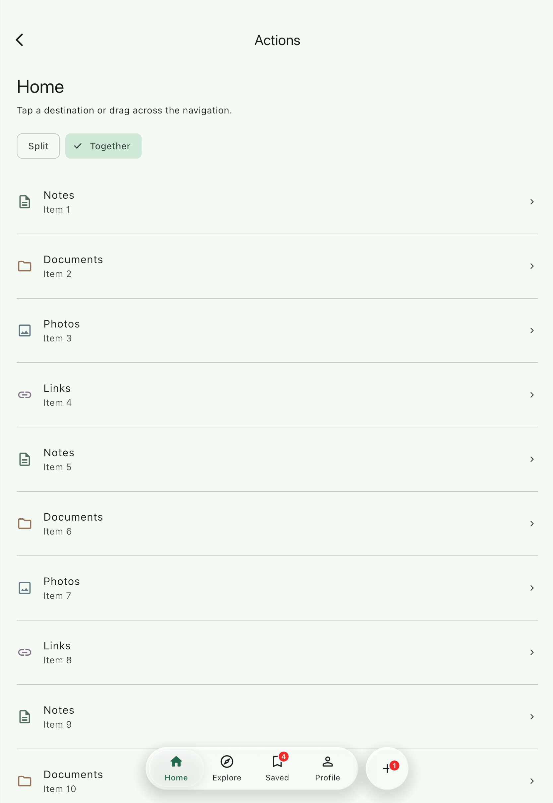
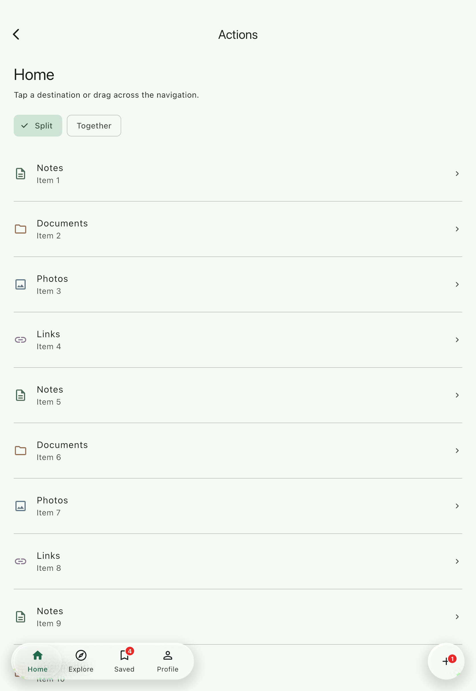
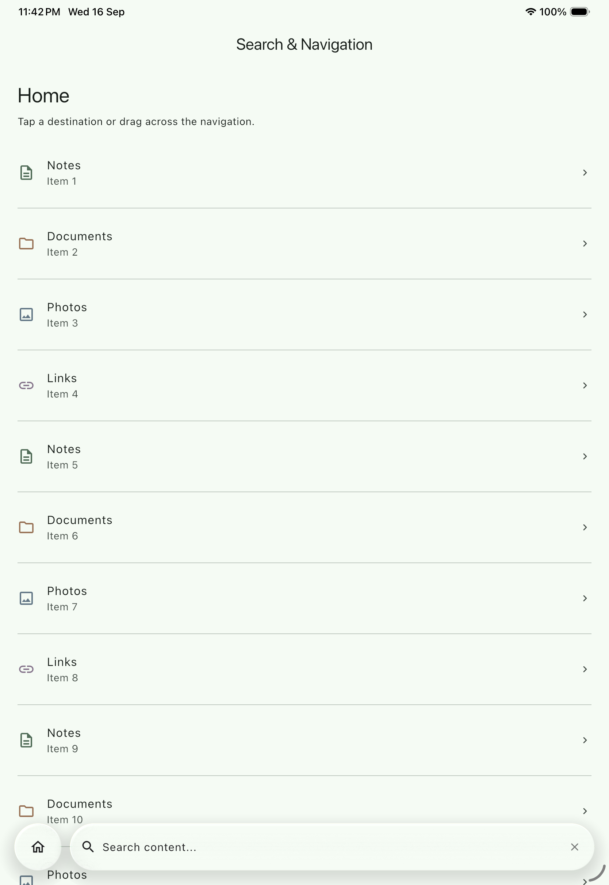

# liquid_tab_bar

A floating glass tab bar for Flutter. It supports a moving selection lens,
search, action buttons, badges, and a compact shape while scrolling.

Package version in this repository: `2.0.0`

[](https://pub.dev/packages/liquid_tab_bar)
[](LICENSE)

---

## iOS simulator preview

Current normal styles on an iPhone 17 Pro Max simulator. Both images show the
same tab bar with a selected tab and a notification badge.

| Light | Dark |
|:---:|:---:|
|  |  |

---

## Features

- **Animated selection**: Tap or drag across tabs; the glass lens follows and
  settles on the selected tab.
- **Glass with fallbacks**: Uses shader glass where supported, backdrop blur
  elsewhere, and an opaque mode when needed.
- **Search and actions**: Add an expandable search field or a separate action
  button beside the tabs.
- **Icons and badges**: Use Flutter icons or your own widgets, plus unread
  dots, counts, or text badges.
- **Scroll folding**: The bar can shrink to a small pill while you scroll and
  expand again when you return.
- **Accessibility**: Supports screen readers, right-to-left layouts, and
  reduced motion settings.

---

## Installation

Install the published `2.0.0` package from pub.dev with this in your app's
`pubspec.yaml`:

```yaml
dependencies:
  liquid_tab_bar: ^2.0.0
```

To develop against a local checkout instead, use a path dependency. Adjust the
path to where you cloned this repository:

```yaml
dependencies:
  liquid_tab_bar:
    path: ../liquid_tab_bar
```

Then run `flutter pub get`. Import the package in your Dart file:

```dart
import 'package:liquid_tab_bar/liquid_tab_bar.dart';
```

The glass shaders are bundled with the package. Your app does not need to
declare them as assets.

> [!NOTE]
> SVG support is optional. If you use SVG icons, add an SVG package such as
> `flutter_svg` to your app. Standard Flutter icons work without it.

## Quick Start

This complete `lib/main.dart` example shows three tabs and a scrollable page:

```dart
import 'package:flutter/material.dart';
import 'package:liquid_tab_bar/liquid_tab_bar.dart';

Future<void> main() async {
  WidgetsFlutterBinding.ensureInitialized();
  await LiquidGlass.load();
  runApp(const DemoApp());
}

class DemoApp extends StatefulWidget {
  const DemoApp({super.key});

  @override
  State<DemoApp> createState() => _DemoAppState();
}

class _DemoAppState extends State<DemoApp> {
  int selectedIndex = 0;

  @override
  Widget build(BuildContext context) {
    const tabLabels = ['Home', 'Explore', 'Profile'];
    return MaterialApp(
      home: LiquidTabBarScaffold(
        appBar: AppBar(title: const Text('Liquid Tab Bar')),
        body: ListView.builder(
          itemCount: 30,
          itemBuilder: (context, index) => ListTile(
            title: Text('${tabLabels[selectedIndex]} item ${index + 1}'),
          ),
        ),
        tabBar: LiquidTabBar(
          selectedIndex: selectedIndex,
          onSelected: (index) => setState(() => selectedIndex = index),
          items: const [
            LiquidTabItem.icon(label: 'Home', icon: Icons.home_outlined),
            LiquidTabItem.icon(label: 'Explore', icon: Icons.explore_outlined),
            LiquidTabItem.icon(label: 'Profile', icon: Icons.person_outline),
          ],
        ),
      ),
    );
  }
}
```

Save the file and run `flutter run`.

`selectedIndex` tells the bar which tab is active. `onSelected` updates your
app state when the user chooses a tab. Replace the sample `ListView` with your
own content. `LiquidTabBarScaffold` lets the page draw behind the floating bar,
adds bottom space so the last list item stays visible, and handles scroll
folding. `LiquidGlass.load()` prepares the shader; the bar falls back to blur
when shader glass is unavailable.

For multiple destinations, keep one bar above your page container, such as a
`PageView` or `IndexedStack`, and keep `selectedIndex` in sync with the visible
destination.

---

## Custom Icons

Use standard icons or any Flutter widget, including SVGs, images, and custom
painters. `LiquidTabItem.icon` is the concise option for Material icons;
`LiquidTabItem.custom` accepts a widget and an optional `activeIcon`.


```dart
LiquidTabItem.custom(
  label: 'Explore',
  icon: SvgPicture.asset('assets/icons/explore.svg'),
  activeIcon: SvgPicture.asset('assets/icons/explore_filled.svg'),
  iconSize: 22,
  useThemeColor: false, // preserve multicolor artwork
)
```

Custom widgets are tinted with the theme's selected and unselected colors by
default. Set `useThemeColor: false` to keep their original colors. The package
accepts ordinary widgets and does not bundle an SVG or image library.

### Keyboard behavior

The bar moves above the keyboard by default. To keep it at the bottom for
ordinary text fields, set `liftAboveKeyboard: false` and
`resizeToAvoidBottomInset: false` on the host `Scaffold`. Built-in search still
moves above the keyboard.

---

## Styling & Optics

`LiquidTabBarTheme` controls the selected and unselected colors, outer bar,
selected lens, and refraction. It follows the app's light or dark brightness by
default. Use `LiquidTabBarTheme.adaptive(context)` to also use the app's primary
color, or pin a palette with `LiquidTabBarTheme.dark()`.

```dart
theme: LiquidTabBarTheme.adaptive(context).copyWith(
  activeColor: const Color(0xFF007AFF),
  barStyle: LiquidBarStyle.glossy(),
  dropletRefraction: const DropletRefractionStyle.medium(),
),
```

### Material tiers

| Tier | Rendering |
|:---|:---|
| `auto` (default) | Uses shader glass when supported; otherwise falls back to blur. |
| `glass` | Fragment shaders sample and refract the backdrop (Impeller required). |
| `blur` | Cross-platform frosted glass. |
| `opaque` | Solid, high-contrast surface. |

### Native backdrop glass

```dart
theme: LiquidTabBarTheme(barStyle: LiquidBarStyle.native()),
```

Native adds clear refraction and polished reflections with a slim rim. On the
shader tier, its tint responds to the actual content behind the bar. Unselected
icons and labels use difference compositing against the rendered glass, so they
become dark over light content and light over dark content. Colored backgrounds
can produce complementary glyph colors. Selected tabs retain the accent color.
The blur fallback uses neutral translucent glass; opaque accessibility mode uses
the standard solid palette. Custom glyphs must honor the supplied icon color. Artwork with its own
compositing layers (such as filtered SVGs) uses the theme contrast color.
Pass `brightness:` to pin the palette without disabling backdrop response.

Light mode keeps a luminous glass base over dark artwork; dark mode uses a
charcoal base. Foreground contrast follows the resulting glass, rather than
simply using the app's light/dark mode. Use `nativeColors` (below) to supply
selected colors for light and dark glass and a fixed inactive color.

The selection droplet reacts to movement across all presets: faster sideways
travel stretches and flattens it; braking and reversing squeeze it vertically
before the spring restores its original resting size. Directional end curvature
is shared by its fill, reflection, clip and optical shader. Its resting width
stays the same across tabs, and pressing retains the outward lift. Reduced
motion disables the extra movement deformation. No continuous polling timer or
screen readback is needed for this motion.

### Glossy and light/dark styles

`LiquidBarStyle.glossy()` follows ambient brightness. Pass `brightness:` to pin
it. Glossy adds a clearer bevel while retaining the same glass family.

| Glossy Light | Glossy Dark |
|:---:|:---:|
|  |  |

```dart
theme: LiquidTabBarTheme(barStyle: LiquidBarStyle.glossy()),
```

Outer bar appearance is set by `LiquidBarStyle` and `GlassStyle`. Presets
include `frosted`, `prismaticCaustics`, `clearCrystal`, and `deepRefraction`.
The selected lens surface is configured independently through
`LiquidDropletSurfaceStyle`, including its gradient, border, and
`LiquidDropletShadow`.

#### Tune capsule frost separately from the moving lens

`barStyle.glass` controls the capsule; `dropletRefraction` controls how the
moving lens bends tab content. For a frosted capsule without backdrop bending or
RGB splitting, start with:

```dart
final brightness = Theme.of(context).brightness;
final glossy = LiquidBarStyle.glossy(brightness: brightness);
final frostedCapsule = glossy.copyWith(
  glass: glossy.glass.copyWith(
    depth: 0, // Disable capsule backdrop bending.
    dispersion: 0, // Disable RGB color splitting.
    blur: glossy.glass.blur * 0.8,
    tint: glossy.glass.tint.withValues(alpha: 0.64),
  ),
);

final lensRefraction = brightness == Brightness.dark
    ? LiquidTabBarTheme.darkGlossyRefraction
    : LiquidTabBarTheme.lightGlossyRefraction;

LiquidTabBar(
  theme: LiquidTabBarTheme.adaptive(context).copyWith(
    barStyle: frostedCapsule,
    dropletRefraction: lensRefraction,
  ),
  items: items,
  selectedIndex: selectedIndex,
  onSelected: onSelected,
)
```

The blur and tint values are starting points; increase them for a more opaque
frosted look or reduce them to show more of the content behind the capsule.

### Droplet refraction

The moving lens bends the icons and labels behind it; displacement and color
separation fade at rest. `DropletRefractionStyle` presets are `none()`,
`subtle()`, `medium()` (default), and `strong()`. Set `dispersion: 0` to disable
RGB separation while retaining refraction.

```dart
theme: const LiquidTabBarTheme(
  dropletRefraction: DropletRefractionStyle.strong(),
),
```

Advanced controls are `thickness` (bevel width), `refractiveIndex`, `baseHeight`
(optical depth), `dispersion`, `specularStrength`, and `refractionStrength`.
When omitted, the theme selects calibrated Normal, Glossy, or Native values. Explicit
values are respected.

## Actions & Placement

| Together | Split |
|:---:|:---:|
|  |  |

Attach a standalone circular button (such as Create, Filter, or Search) alongside the navigation capsule:

```dart
separateAction: LiquidTabAction.icon(
  icon: Icons.add_rounded,
  tooltip: 'Create',
  onTap: handleCreate,
),
separateActionPlacement: LiquidTabActionPlacement.together, // or .split
```

- **`LiquidTabActionPlacement.together`** *(default)*: Groups the action circle adjacent to the main capsule.
- **`LiquidTabActionPlacement.split`**: Pins the main capsule to the leading margin and the action button to the trailing margin.
- **Action styling**: Customize the selected action background marker via `actionStyle: const LiquidTabActionStyle(selectedFill: ...)`.

---

## Notification Badges

`LiquidTabItem` includes integrated notification badges with four display modes:

```dart
// 1. Unread dot
LiquidTabItem.icon(
  icon: Icons.mail_rounded,
  label: 'Inbox',
  badge: true,
),

// 2. Count pill (auto-formats 99+ above 99)
LiquidTabItem.icon(
  icon: Icons.notifications_rounded,
  label: 'Alerts',
  badge: true,
  badgeCount: 4,
),
```

- **Text pill**: Pass `badgeText: 'PRO'` for custom string badges.
- **Custom widget**: Supply `badgeWidget` for custom indicator layouts.
- **Styling**: Configure colors, borders, typography, and offsets via `LiquidBadgeStyle`.
- **Optical interaction**: Normal tab badges participate in droplet refraction when overlapped by the moving lens.

---

## Expandable Search



Add an edge-to-edge search field with a separate search action:

```dart
separateAction: LiquidTabAction.search(
  hintText: 'Search notes…',
  clearOnClose: true,
  onChanged: filterResults,
  onSubmitted: submitSearch,
  customIcon: SvgPicture.asset('assets/icons/search.svg'), // optional
),
```

Search moves above the keyboard. Use the controller attached to the bar to call
`controller.openSearch()` or `controller.closeSearch()`. Android back closes
an active search before leaving the page. `customIcon` is also used in the
expanded field; custom icons support `useThemeColor` like tab icons.

In 2.0.0, Search controls separate editing from dismissal:

- The internal X appears when text exists and clears only the query. Its space
  stays reserved while empty; clearing preserves focus and does not navigate.
- The existing glass circle becomes a directional back chevron and dismisses
  Search through `onClose`. The application decides which page to show next.
- `clearOnClose` remains independent and defaults to `false`. Set it to `true`
  to reset the query when Search closes; it does not affect the clear button.
- An explicit `controller.openSearch()` cancels a pending keyboard dismissal.

For the earlier combined internal-X dismissal and selected-tab circle, use:

```dart
separateAction: LiquidTabAction.search(
  controls: LiquidSearchControls.legacy,
  // Other Search configuration remains unchanged.
),
```

## Adaptive Folding


### Automatic Folding (Recommended)

When using `LiquidTabBarScaffold`, vertical scrolling in primary body scrollables automatically folds the bar into a compact pill showing only the active tab:

```dart
LiquidTabBarScaffold(
  body: ListView.builder(
    itemCount: 50,
    itemBuilder: (context, i) => ListTile(title: Text('Item $i')),
  ),
  tabBar: LiquidTabBar(
    shrinkOnScroll: true,                  // Set false to keep permanently expanded
    foldedShape: LiquidFoldedShape.circle, // .circle or .oval
    // ...
  ),
)
```

`LiquidTabBarScaffold` automatically observes primary vertical body scrolling; no `NotificationListener` or controller management is required for normal layouts. Scrolling back up, reaching the top of content, or tapping the folded capsule smoothly unfolds the bar.

#### Pages inside a horizontal PageView

The 2.0.0 default, `LiquidAutoFoldPolicy.smart()`, detects the active scroll
source in full-width horizontal PageViews, including nested TabBarViews:

```dart
LiquidTabBarScaffold(
  body: PageView(children: pages),
  tabBar: tabBar,
)
```

Smart mode accepts a unique root vertical scrollable through up to four enclosing
horizontal pagers. Every pager must display that source's settled active page.
It rejects inactive pages, page transitions, nested vertical lists, offstage
sources, and ambiguous sibling scroll branches. It does not require explicit
PageControllers or application notification forwarding. Fractional pages, deeper
chains, and layouts whose ownership cannot be established are deliberately
ignored. Discovery shares a 4,096-visit budget; oversized trees fail closed.

To retain the earlier depth-zero automatic behavior, select the explicit legacy
policy:

```dart
autoFoldPolicy: const LiquidAutoFoldPolicy.direct(),
```

For an ambiguous layout, explicitly choose its relevant source:

```dart
autoFoldPolicy: LiquidAutoFoldPolicy.custom((notification) =>
    primaryScrollController.hasClients &&
    notification.context == primaryScrollController.position.context.notificationContext),
```

The predicate **replaces** automatic eligibility. Vertical-axis, mounted-context,
body-boundary, offstage, and known inactive-page guards still apply. For unsupported
page layouts, the predicate is responsible for selecting only the active source.
Returning false disables scaffold forwarding; existing manual controller forwarding
still works. `shrinkOnScroll: false` disables scaffold forwarding for every policy.

Programmatic vertical scrolling retains the existing fold policy. Changing scroll
owners resets accumulated distance and direction, preserving the current fold
state. Page movement revokes the previous scroll session, including its stale
fling; a new scroll start is required before that source can control folding again.
Forwarding the same notification manually and automatically processes it once.

### Manual integration

For custom `Scaffold` layouts, multiple independent vertical scroll sources, or complex nested scrolling, forward notifications explicitly:

```dart
final controller = LiquidTabBarController();

NotificationListener<ScrollNotification>(
  onNotification: controller.handleScroll,
  child: myScrollView,
)

LiquidTabBar(
  controller: controller,
  shrinkOnScroll: true,
  // ...
)
```

---

## Controller, layout & accessibility

`LiquidTabBarScaffold` is the recommended layout: it enables `extendBody`,
reserves scroll space, and observes primary vertical scrolling for folding.
With a regular `Scaffold`, set `extendBody: true` and add
`LiquidTabBar.reservedPadding(context)` to scrollable content. For slivers, use
`SliverLiquidScrollPadding()`.

For manual scroll handling, forward notifications to
`LiquidTabBarController.handleScroll`. The controller also exposes
`minimize()`, `expand()`, `openSearch()`, `closeSearch()`, and performance
governor status. Selection remains app-owned via `selectedIndex` and
`onSelected`.

The bar follows ambient RTL directionality and provides screen-reader
semantics. It respects `MediaQuery.disableAnimationsOf(context)` for reduced
motion. `LiquidFoldedShape.circle` is the default; use `.oval` for an oval
folded bar.

---

## Advanced Governor Tuning

A standalone bar using the shared controller and auto material arms the governor
automatically. `LiquidTabBarScaffold` retains shared-governor inheritance; arm the
shared controller at startup when using that wrapper. Explicit controllers remain
app-owned and must be armed with `controller.armGovernor()`. The governor monitors GPU raster timings during glass shader execution and automatically downgrades to backdrop blur if slow frames exceed default thresholds (`rasterThresholdMs: 24`, `maxSlowFrames: 12`).

For custom performance budgets, configure explicit thresholds on your controller:

```dart
final controller = LiquidTabBarController(
  governorConfig: const LiquidGovernorConfig(
    rasterThresholdMs: 20,
    maxSlowFrames: 8,
  ),
);
controller.armGovernor();
```

---

## Example Application

The repository includes interactive demonstrations:

- **Style Comparison**: Normal/Glossy palettes and one adaptive Native preset.
- **Basic Navigation**: Standard bottom bar with fluid spring droplet.
- **Styling & Refraction**: Custom materials, light/dark themes, and refraction presets.
- **Action Buttons**: Together and Split action placements.
- **Search & Folding**: Expandable search morphing, circle/oval folding, and live RTL layout.
- **Custom Icons Demo**: Standard `IconData`, custom SVG widgets, activeIcon switching, theme tinting vs original multi-color artwork, custom Search glyphs, and Search glyph sizing.
- **Text Form Field**: Keyboard behavior with the bar visible.

```sh
cd example
flutter run
```

## 2.0.0 migration

Version 2.0.0 consolidates the public API around the droplet navigation bar
and removes obsolete or duplicate options. See the
[migration guide](doc/api_cleanup_migration.md) for source changes.

---

## Credits

Version 2.0.0 consolidates the package around the droplet navigation bar. The
bar, scaffold, refraction shader, search, actions, badges, style objects, and
Android Impeller backdrop fix were created by
[Mohammed Hafiz](https://github.com/MohammedHafiz27)
([#5](https://github.com/ahmedmarwan47-stack/orderbase_delivery_app/pull/5)).
[Yousef Sobhy](https://github.com/yousefsobhy12)
([#4](https://github.com/ahmedmarwan47-stack/orderbase_delivery_app/pull/4))
contributed the fold-and-unfold lens fixes in 1.0.1. The package originated in
the Orderbase courier app.

---

## License

This package is licensed under the MIT License. See [LICENSE](LICENSE) for details.

### Native foreground colors

Optionally choose selected colors for the actual light/dark glass beneath each
icon, plus a fixed inactive color:

```dart
theme: LiquidTabBarTheme(
  barStyle: LiquidBarStyle.native(),
  nativeColors: const LiquidNativeColors(
    activeLight: Color(0xFF34349D),
    activeDark: Color(0xFFB6B6FF),
    inactive: Color(0xFF8E8E93),
  ),
),
```

Selected icons and labels interpolate between the colors using local painted
luminosity, including split backdrops, without pixel readback or a Dart timer.
Use opaque palette colors. This optional effect adds four small blend passes
per selected foreground; benchmark it on target hardware. Composited custom
icons use the ambient palette fallback, and full-color artwork can opt out.
Opaque accessibility material uses the ambient selected color. Omit
`nativeColors` to retain the default behavior, or use
`copyWith(clearNativeColors: true)` to remove an override.
